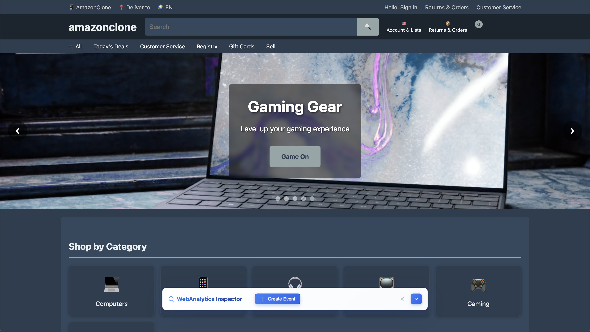

# Inspector Toolbar SDK

A powerful JavaScript SDK for creating interactive web analytics inspection tools with a modern, sticky toolbar interface. **Inspired by PostHog's toolbar**, this SDK provides an intuitive way for marketers and developers to inspect and create custom events for web analytics tracking without needing technical expertise.



## Features

### 🎯 **Interactive Element Inspection**
- **Visual Element Highlighting**: Hover over any element to see it highlighted with a blue border
- **CSS Selector Generation**: Automatically generates precise CSS selectors for selected elements
- **Real-time Tooltips**: Shows the generated selector in a tooltip while hovering
- **Crosshair Cursor**: Visual feedback when inspection mode is active

### 📊 **Custom Event Creation**
- **Comprehensive Form**: Create custom analytics events with all necessary fields
- **Dynamic Paths & Attributes**: Add multiple paths and attributes with add/remove functionality
- **Form Validation**: Real-time validation with visual error indicators
- **API Integration**: Built-in API call functionality for event submission

### 🎨 **Modern UI/UX**
- **Sticky Toolbar**: Fixed position toolbar that slides in from the bottom
- **Collapsible Interface**: Expandable form that doesn't clutter the page
- **Responsive Design**: Works seamlessly across different screen sizes
- **RTL Support**: Full right-to-left layout support
- **Smooth Animations**: Elegant transitions and hover effects

### 🔧 **Developer Friendly**
- **UMD Module**: Works with any module system (CommonJS, AMD, or global)
- **Customizable**: Extensive configuration options
- **Lightweight**: Minimal footprint with optimized bundle size
- **TypeScript Ready**: Written in modern JavaScript with clear interfaces

### 📈 **Marketer Friendly**
- **No-Code Event Creation**: Marketers can create custom events without writing code
- **Visual Element Selection**: Click-to-select interface for choosing target elements
- **Real-time Preview**: See exactly what elements will be tracked
- **Analytics Tool Integration**: Works with popular analytics platforms (Google Analytics, Mixpanel, Amplitude, etc.)

## Installation

### NPM
```bash
npm install inspector-toolbar-sdk
```

### CDN
```html
<script src="https://unpkg.com/inspector-toolbar-sdk@latest/dist/inspector-toolbar.js"></script>
```

## Quick Start

Perfect for marketers who want to create custom events for their web analytics tools without technical knowledge. Simply click on elements to select them and fill out the form to create tracking events.

### Basic Usage
```html
<!DOCTYPE html>
<html>
<head>
    <title>My Website</title>
</head>
<body>
    <!-- Your website content -->
    
    <script src="inspector-toolbar.js"></script>
    <script>
        // Initialize the inspector toolbar
        const toolbar = new InspectorToolbar().init();
        
        // Show the toolbar
        toolbar.show();
    </script>
</body>
</html>
```

### Advanced Configuration
```javascript
const toolbar = new InspectorToolbar({
    position: 'bottom',        // 'top' or 'bottom'
    height: '60px',           // Custom height
    backgroundColor: '#ffffff', // Custom background
    textColor: '#1e293b'      // Custom text color
}).init();

// Show/hide the toolbar
toolbar.show();
toolbar.hide();
toolbar.toggle();
```

## API Reference

### Constructor Options

| Option | Type | Default | Description |
|--------|------|---------|-------------|
| `position` | string | `'bottom'` | Position of toolbar: `'top'` or `'bottom'` |
| `height` | string | `'60px'` | Height of the toolbar |
| `backgroundColor` | string | `'#ffffff'` | Background color of the toolbar |
| `textColor` | string | `'#1e293b'` | Text color of the toolbar |

### Methods

#### `init()`
Initializes the toolbar and attaches it to the page.
```javascript
const toolbar = new InspectorToolbar().init();
```

#### `show()`
Shows the toolbar with a smooth slide-in animation.
```javascript
toolbar.show();
```

#### `hide()`
Hides the toolbar with a smooth slide-out animation.
```javascript
toolbar.hide();
```

#### `toggle()`
Toggles the visibility of the toolbar.
```javascript
toolbar.toggle();
```

#### `destroy()`
Removes the toolbar and cleans up all event listeners.
```javascript
toolbar.destroy();
```

## Event Creation

The toolbar provides a comprehensive form for creating custom analytics events, making it easy for marketers to set up tracking without developer intervention:

### Required Fields
- **Category**: Event category (Analytics, Engagement)
- **Event Type**: Type of event (click, scroll, submit, etc.)
- **Counting Type**: How to count the event (Once, Every Time)
- **CSS Selector**: Target element selector (auto-generated via inspection)

### Dynamic Fields
- **Paths**: Multiple path configurations with type and value
- **Attributes**: Custom attributes with key-value pairs

### Form Validation
- Real-time validation with visual error indicators
- Required field validation
- Dynamic field validation for paths and attributes

## Element Inspection

### Activating Inspection Mode
1. Click the "Create Event" button to expand the form
2. Click the crosshair icon next to the CSS Selector field
3. The cursor will change to a crosshair
4. Hover over any element to see it highlighted
5. Click on an element to select it and generate its CSS selector

**Perfect for marketers**: No need to understand CSS or HTML structure - just click on the element you want to track!

### Generated Selectors
The SDK generates precise CSS selectors that uniquely identify elements:
```css
body > main > section:nth-child(2) > div > div:nth-child(1) > button
```

## Styling & Customization

### CSS Customization
The toolbar uses CSS custom properties for easy theming:

```css
.inspector-toolbar {
    --toolbar-bg: #ffffff;
    --toolbar-color: #1e293b;
    --primary-color: #3b82f6;
    --border-color: #e2e8f0;
}
```

### RTL Support
The toolbar automatically supports right-to-left layouts:
```html
<html dir="rtl">
    <!-- RTL layout will be automatically applied -->
</html>
```

## Development

### Building from Source
```bash
# Install dependencies
npm install

# Development build with watch mode
npm run dev

# Production build
npm run build

# Analyze bundle size
npm run build:analyze

# Serve demo site
npm run serve
```

### Project Structure
```
inspector-toolbar/
├── src/
│   ├── index.js          # Main SDK implementation
│   └── styles.css        # Styling and animations
├── site/
│   ├── index.html        # Demo page
│   └── inspector-toolbar.js  # Built SDK
├── assets/               # Screenshots and images
├── webpack.config.js     # Build configuration
└── package.json          # Dependencies and scripts
```

## Browser Support

- Chrome 60+
- Firefox 55+
- Safari 12+
- Edge 79+

## License

MIT License - see [LICENSE](LICENSE) file for details.

## Contributing

1. Fork the repository
2. Create a feature branch (`git checkout -b feature/amazing-feature`)
3. Commit your changes (`git commit -m 'Add amazing feature'`)
4. Push to the branch (`git push origin feature/amazing-feature`)
5. Open a Pull Request

## Support

For support and questions:
- Create an issue on GitHub
- Check the demo page for examples
- Review the inline code documentation

## Use Cases

- **Marketing Teams**: Create custom conversion tracking events without developer help
- **Product Managers**: Set up user behavior tracking for feature adoption analysis
- **Analytics Teams**: Quickly prototype and test new tracking implementations
- **Agencies**: Provide clients with easy-to-use analytics setup tools

---

**Built with ❤️ for the web analytics community**

*Inspired by PostHog's excellent toolbar interface* 