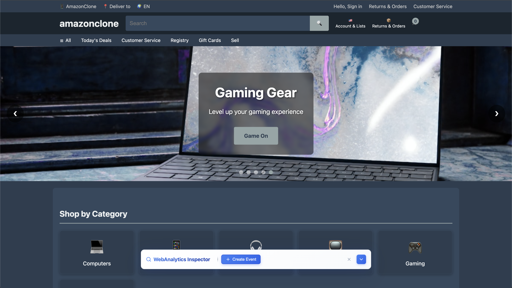
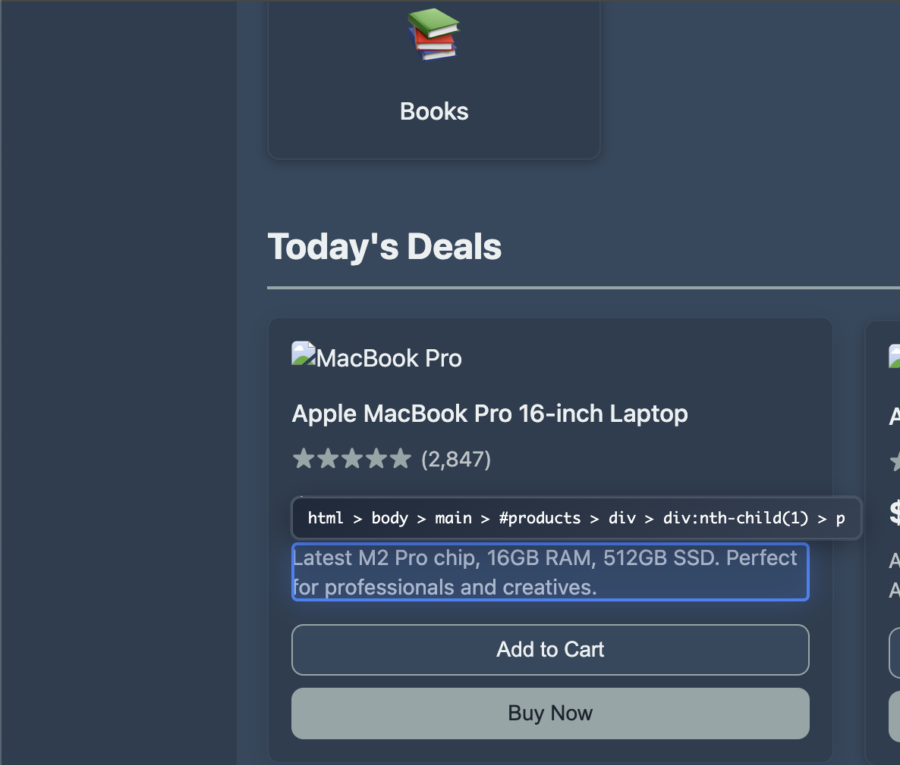
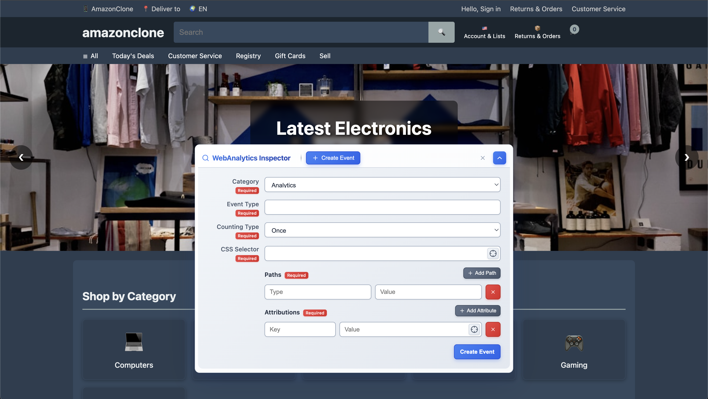

# Inspector Toolbar SDK

A powerful JavaScript SDK for creating interactive web analytics inspection tools with a modern, sticky toolbar interface. **Inspired by PostHog's toolbar**, this SDK provides an intuitive way for marketers and developers to inspect and create custom events for web analytics tracking without needing technical expertise.







## Features

### 🛡️ **Shadow DOM Isolation**
- **Complete Style Isolation**: Uses Shadow DOM to prevent any CSS conflicts with host websites
- **No Style Inheritance**: Toolbar maintains its appearance regardless of aggressive global styles
- **Works Everywhere**: Functions perfectly on any website, no matter how complex their CSS
- **Zero Conflicts**: No !important battles or specificity issues

### 🎯 **Interactive Element Inspection**
- **Visual Element Highlighting**: Hover over any element to see it highlighted with a blue border
- **CSS Selector Generation**: Automatically generates precise CSS selectors for selected elements
- **Real-time Tooltips**: Shows the generated selector in a tooltip while hovering
- **Crosshair Cursor**: Visual feedback when inspection mode is active

### 📊 **Custom Event Creation**
- **Comprehensive Form**: Create custom analytics events with all necessary fields
- **Dynamic Paths & Attributes**: Add multiple paths and attributes with add/remove functionality
- **Form Validation**: Real-time validation with visual error indicators
- **API Integration**: Built-in API call functionality for event submission

### 🎨 **Modern UI/UX**
- **Sticky Toolbar**: Fixed position toolbar that slides in from the bottom
- **Collapsible Interface**: Expandable form that doesn't clutter the page
- **Responsive Design**: Works seamlessly across different screen sizes
- **RTL Support**: Full right-to-left layout support
- **Smooth Animations**: Elegant transitions and hover effects

### 🔧 **Developer Friendly**
- **UMD Module**: Works with any module system (CommonJS, AMD, or global)
- **Customizable**: Extensive configuration options
- **Lightweight**: Minimal footprint with optimized bundle size
- **TypeScript Ready**: Written in modern JavaScript with clear interfaces

### 📈 **Marketer Friendly**
- **No-Code Event Creation**: Marketers can create custom events without writing code
- **Visual Element Selection**: Click-to-select interface for choosing target elements
- **Real-time Preview**: See exactly what elements will be tracked
- **Analytics Tool Integration**: Works with popular analytics platforms (Google Analytics, Mixpanel, Amplitude, etc.)

## Installation

> **TODO**: This package is not yet published to npm. For now, you can build from source or use the built file directly.

### NPM (Coming Soon)
```bash
npm install inspector-toolbar-sdk
```

### CDN (Coming Soon)
```html
<script src="https://unpkg.com/inspector-toolbar-sdk@latest/dist/inspector-toolbar.js"></script>
```

### Current Installation
Since the package is not yet published, you can:

1. **Clone the repository**:
```bash
git clone https://github.com/your-username/inspector-toolbar.git
cd inspector-toolbar
```

2. **Build from source**:
```bash
npm install
npm run build
```

3. **Use the built file**:
```html
<script src="site/inspector-toolbar.js"></script>
```

## Quick Start

Perfect for marketers who want to create custom events for their web analytics tools without technical knowledge. Simply click on elements to select them and fill out the form to create tracking events.

### Basic Usage
```html
<!DOCTYPE html>
<html>
<head>
    <title>My Website</title>
</head>
<body>
    <!-- Your website content -->
    
    <script src="inspector-toolbar.js"></script>
    <script>
        // Initialize the inspector toolbar
        const toolbar = new InspectorToolbar().init();
        
        // Show the toolbar
        toolbar.show();
    </script>
</body>
</html>
```

### Advanced Configuration
```javascript
const toolbar = new InspectorToolbar({
    // API Configuration
    apiUrl: 'https://your-api.com/api/v1/',  // Your API endpoint
    token: 'your-auth-token',                 // Authentication token
    
    // UI Configuration
    position: 'bottom',        // 'top' or 'bottom'
    height: '60px',           // Custom height
    backgroundColor: '#ffffff', // Custom background
    textColor: '#1e293b',     // Custom text color
    
    // Development
    debug: false,             // Enable debug logging
    
    // Pre-configured events to display
    events: [
        {
            cssSelector: '#buy-button',
            eventType: 'Purchase Click'
        }
    ]
}).init();

// Show/hide the toolbar
toolbar.show();
toolbar.hide();
toolbar.toggle();
```

## API Reference

### Constructor Options

| Option | Type | Default | Description |
|--------|------|---------|-------------|
| `apiUrl` | string | `null` | API endpoint for creating events |
| `token` | string | `null` | Authentication token for API requests |
| `position` | string | `'bottom'` | Position of toolbar: `'top'` or `'bottom'` |
| `height` | string | `'60px'` | Height of the toolbar |
| `backgroundColor` | string | `'#ffffff'` | Background color of the toolbar |
| `textColor` | string | `'#1e293b'` | Text color of the toolbar |
| `debug` | boolean | `false` | Enable debug logging to console |
| `events` | array | `[]` | Pre-configured events to highlight on page load |

### Methods

#### `init()`
Initializes the toolbar and attaches it to the page.
```javascript
const toolbar = new InspectorToolbar().init();
```

#### `show()`
Shows the toolbar with a smooth slide-in animation.
```javascript
toolbar.show();
```

#### `hide()`
Hides the toolbar with a smooth slide-out animation.
```javascript
toolbar.hide();
```

#### `toggle()`
Toggles the visibility of the toolbar.
```javascript
toolbar.toggle();
```

#### `destroy()`
Removes the toolbar and cleans up all event listeners.
```javascript
toolbar.destroy();
```

## API Integration

### Authentication
The SDK supports two methods for providing authentication:

1. **Via Constructor Options (Recommended)**:
```javascript
const toolbar = new InspectorToolbar({
    apiUrl: 'https://your-api.com/api/v1/',
    token: 'your-secure-token'
}).init();
```

2. **Via URL Parameters** (for testing):
```
https://yoursite.com?api_url=https://your-api.com/api/v1/&token=your-token
```

### API Endpoints
The SDK expects the following endpoints:

- `GET {apiUrl}/analytics/categories/structure` - Fetch available categories and attributes
- `POST {apiUrl}/goals/site/domain/{domain}` - Create a new custom event

### Event Payload Format
When creating an event, the SDK sends:
```json
{
  "name": "Button Click",
  "category": "goal",
  "custom_category": "ecommerce",
  "event_type": "click",
  "count_method": "per_event",
  "domain": "yoursite.com",
  "selector": {
    "type": "css_selector",
    "value": "#buy-button"
  },
  "page_url": [{
    "operator": "contains",
    "url": "/products"
  }],
  "attributes": {
    "product_id": {
      "type": "css_selector",
      "value": "[data-product-id]",
      "value_type": "varchar"
    }
  }
}
```

## Event Creation

The toolbar provides a comprehensive form for creating custom analytics events, making it easy for marketers to set up tracking without developer intervention:

### Required Fields
- **Category**: Event category (Analytics, Engagement)
- **Event Type**: Type of event (click, scroll, submit, etc.)
- **Counting Type**: How to count the event (Once, Every Time)
- **CSS Selector**: Target element selector (auto-generated via inspection)

### Dynamic Fields
- **Paths**: Multiple path configurations with type and value
- **Attributes**: Custom attributes with key-value pairs

### Form Validation
- Real-time validation with visual error indicators
- Required field validation
- Dynamic field validation for paths and attributes

## Element Inspection

### Activating Inspection Mode
1. Click the "Create Event" button to expand the form
2. Click the crosshair icon next to the CSS Selector field
3. The cursor will change to a crosshair
4. Hover over any element to see it highlighted
5. Click on an element to select it and generate its CSS selector

**Perfect for marketers**: No need to understand CSS or HTML structure - just click on the element you want to track!

### Generated Selectors
The SDK generates precise CSS selectors that uniquely identify elements:
```css
body > main > section:nth-child(2) > div > div:nth-child(1) > button
```

## Keyboard Shortcuts

The toolbar supports keyboard navigation for improved accessibility:

| Shortcut | Action |
|----------|--------|
| `Ctrl/Cmd + Shift + E` | Toggle toolbar visibility |
| `Ctrl/Cmd + I` | Start/stop element inspection mode |
| `Escape` | Exit inspection mode or collapse form |
| `Arrow Left` | Navigate to previous step |
| `Arrow Right` | Navigate to next step |
| `Enter` | Submit form (when on last step) |
| `Tab` | Navigate between form fields |

## Styling & Customization

### CSS Customization
The toolbar uses CSS custom properties for easy theming:

```css
.inspector-toolbar {
    --toolbar-bg: #ffffff;
    --toolbar-color: #1e293b;
    --primary-color: #3b82f6;
    --border-color: #e2e8f0;
}
```

### RTL Support
The toolbar automatically supports right-to-left layouts:
```html
<html dir="rtl">
    <!-- RTL layout will be automatically applied -->
</html>
```

## Development

### Building from Source
```bash
# Install dependencies
npm install

# Development build with watch mode
npm run dev

# Production build
npm run build

# Analyze bundle size
npm run build:analyze
# View the report at dist/bundle-report.html

# Serve demo site
npm run serve
```

### Performance Optimization

The SDK is optimized for minimal impact on your website:

- **Bundle Size**: ~53KB minified (includes Shadow DOM and all styles)
- **Shadow DOM**: Complete style isolation with zero CSS conflicts
- **Lazy Loading**: Form components only render when needed
- **Event Delegation**: Minimal event listeners for better performance
- **Self-Contained**: All styles encapsulated in Shadow DOM
- **Tree Shaking**: Production builds remove unused code

To further reduce bundle size:
1. Use a CDN to cache the SDK across sites
2. Enable gzip compression on your server
3. Load the SDK asynchronously:
```javascript
// Async loading pattern
(function() {
  const script = document.createElement('script');
  script.src = 'https://cdn.example.com/inspector-toolbar.js';
  script.async = true;
  script.onload = function() {
    new InspectorToolbar({ /* config */ }).init();
  };
  document.head.appendChild(script);
})();
```

### Project Structure
```
inspector-toolbar/
├── src/
│   ├── index.js          # Main SDK implementation
│   └── styles.css        # Styling and animations
├── site/
│   ├── index.html        # Demo page
│   └── inspector-toolbar.js  # Built SDK
├── assets/               # Screenshots and images
├── webpack.config.js     # Build configuration
└── package.json          # Dependencies and scripts
```

## Shadow DOM Benefits

The toolbar uses Shadow DOM for complete style isolation:

### Why Shadow DOM?
- **No CSS Conflicts**: Your website's styles won't affect the toolbar
- **No Style Leakage**: The toolbar's styles won't affect your website
- **Works on Any Site**: Functions perfectly regardless of the host's CSS complexity
- **No Specificity Wars**: No need for !important or complex selectors
- **Predictable Appearance**: Looks the same on every website

### Testing Style Isolation
Open `test-shadow.html` to see the toolbar working perfectly despite aggressive global styles that would normally break any UI component.

## Browser Support

- Chrome 60+
- Firefox 63+
- Safari 10.1+
- Edge 79+

Note: Shadow DOM is supported in all modern browsers.

## License

MIT License - see [LICENSE](LICENSE) file for details.

## Contributing

1. Fork the repository
2. Create a feature branch (`git checkout -b feature/amazing-feature`)
3. Commit your changes (`git commit -m 'Add amazing feature'`)
4. Push to the branch (`git push origin feature/amazing-feature`)
5. Open a Pull Request

## Support

For support and questions:
- Create an issue on GitHub
- Check the demo page for examples
- Review the inline code documentation

## Use Cases

- **Marketing Teams**: Create custom conversion tracking events without developer help
- **Product Managers**: Set up user behavior tracking for feature adoption analysis
- **Analytics Teams**: Quickly prototype and test new tracking implementations
- **Agencies**: Provide clients with easy-to-use analytics setup tools

---

**Built with ❤️ for the web analytics community**

*Inspired by PostHog's excellent toolbar interface* 